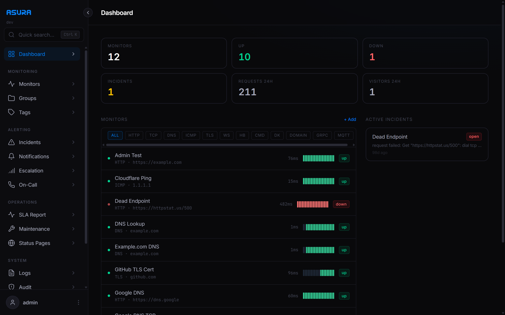

<p align="center">
  
</p>
<p align="center">
  Self-hosted uptime monitoring. One binary, one config file, no dependencies.
</p>
<p align="center">
  <a href="https://github.com/y0f/asura/actions/workflows/ci.yml"></a>
  <a href="https://goreportcard.com/report/github.com/y0f/asura?branch=main"></a>
  <a href="https://github.com/y0f/asura/blob/main/go.mod"></a>
  <a href="LICENSE"></a>
  <a href="https://github.com/y0f/asura/releases/latest"></a>
  <a href="https://github.com/y0f/asura/pkgs/container/asura"></a>
</p>
<p align="center">
  <a href="https://y0f.github.io/asura/">Docs</a> &middot;
  <a href="https://y0f.github.io/asura/#getting-started">Quick Start</a> &middot;
  <a href="https://y0f.github.io/asura/#api">API</a> &middot;
  <a href="CONTRIBUTING.md">Contributing</a>
</p>

---



---

## Install

**One-liner (Ubuntu/Debian):**
```bash
git clone https://github.com/y0f/Asura.git && cd Asura && sudo bash install.sh
```

**Docker:**
```bash
git clone https://github.com/y0f/Asura.git && cd Asura
cp config.example.yaml config.yaml
docker compose up -d
```

Listens on `127.0.0.1:8090`. Use a [reverse proxy](https://y0f.github.io/asura/#deployment) (nginx/Caddy) for public access with TLS.

---

## Features

- **13 monitor types** — HTTP, TCP, DNS, ICMP, TLS, WebSocket, gRPC, MQTT, Docker, Domain/WHOIS, Command, Heartbeat, Manual
- **13 notification channels** — Webhook, Email, Telegram, Discord, Slack, ntfy, Teams, PagerDuty, Opsgenie, Pushover, Google Chat, Matrix, Gotify
- **Assertions** — Status code, body text, regex, JSONPath, headers, response time, cert expiry, DNS records with AND/OR group logic
- **Live dashboard** — Real-time SSE push with sparklines, uptime stats, and bulk operations. Falls back to polling.
- **Public status pages** — 90-day uptime bars, incidents, email/webhook subscriptions, password protection, custom CSS
- **Escalation policies** — Time-based notification chains with per-step delays and repeat
- **SLA tracking** — Per-monitor targets, error budgets, breach alerts, monthly reports
- **Change detection** — Line-level diffs on HTTP response bodies
- **Security** — TOTP 2FA, role-based API keys, SSRF protection, rate limiting

---

## Why Asura?

| Aspect | Asura | Typical alternative |
|---|---|---|
| **Install** | Single binary, `scp` + run | Runtime + database + migrations |
| **Database** | SQLite (built in) | Needs Postgres, MySQL, or Redis |
| **Size** | ~15 MB binary, ~20 MB RAM | 100 MB+, varies by runtime |
| **API** | Full REST API, same as web UI | Often Socket.IO or undocumented |
| **Scale** | 1000+ monitors on a $5 VPS | Node.js alternatives hit walls at 500 |

---

## Docs

- [Getting Started](https://y0f.github.io/asura/#getting-started) — Install, configure, first monitor
- [Deployment](https://y0f.github.io/asura/#deployment) — Reverse proxy, TLS, systemd
- [Configuration](https://y0f.github.io/asura/#configuration) — Full config reference
- [Monitors](https://y0f.github.io/asura/#monitors) — All types, assertions, heartbeats
- [Notifications](https://y0f.github.io/asura/#notifications) — Channels, webhook signing, routing
- [Escalation](https://y0f.github.io/asura/#escalation-policies) — Time-based chains
- [API](https://y0f.github.io/asura/#api) — Endpoints with examples
- [SLA](https://y0f.github.io/asura/#sla) — Targets, budgets, breach alerts
- [Architecture](https://y0f.github.io/asura/#architecture) — Pipeline, storage, internals

---

## Stack

Go 1.25+, stdlib `net/http`, SQLite via `modernc.org/sqlite` (pure Go, zero CGO), [templ](https://templ.guide/), HTMX, Alpine.js, Tailwind CSS v4.

## License

[MIT](LICENSE)
